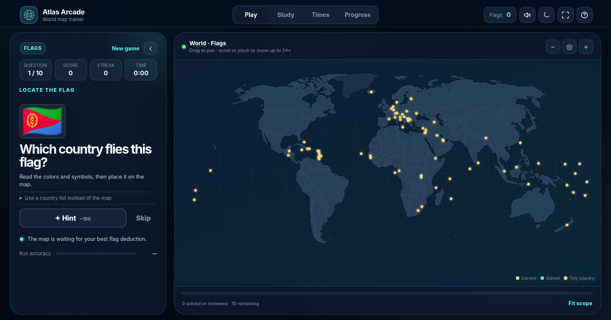

# Atlas Arcade



Atlas Arcade is a responsive world-geography game built as a plain static
website. It opens on a full-screen game picker rather than inside a floating
window. During desktop play, the clue, score, hints, and feedback stay in a
fixed panel on the left while the interactive map stays on the right. On
phones, that panel becomes a slide-out drawer over a full-screen map.

The game works without a framework, build server, package manager, account, or
API key. Progress and personal best times are saved locally as soon as the
files are opened. A Supabase project is optional and adds shared leaderboards
and cross-device accounts.

## Game modes

- **Locate** — see a country name and click it on the map.
- **Capitals** — see a capital and find its country.
- **Flags** — identify bundled flag artwork and locate the country.
- **Map → Name** — type the highlighted country's name.
- **Mixed Mission** — rotate through names, capitals, flags, and map shapes.
- **Spell All** — name all 197 countries in any order.

Every mode can be played normally. **Competitive** is an optional setup
toggle, not a separate game. It standardizes the selected mode to the complete
197-country world set, disables hints and skips, and adds two seconds per
mistake. Each mode has its own fastest-time leaderboard, so Locate, Capitals,
Flags, Map → Name, Mixed Mission, and Spell All never share records.

The answer feedback during play is deliberately quiet: there is no floating
country card or bordered result rectangle over the map after each guess.

## Run it locally

For a quick offline test, open `standalone.html` directly.

For the complete PWA and online-feature test, serve the folder:

```bash
python -m http.server 8000
```

Then open `http://localhost:8000`.

## Publish it

The project includes an automatic GitHub Pages workflow and a separate public
site builder. Follow [`PUBLISHING-GUIDE.md`](PUBLISHING-GUIDE.md) from top to
bottom. The basic flow is:

1. Put this folder at the root of a GitHub repository.
2. Push it to `main`.
3. Select **GitHub Actions** under **Settings → Pages**.
4. Optionally create a Supabase project, run `supabase/schema.sql`, and add the
   browser-safe project URL and publishable key to `config.js`.

The workflow runs `python build_public.py`, uploads only runtime files, and
deploys them to GitHub Pages.

## Public configuration

`config.js` starts with all online services disabled:

```js
window.ATLAS_CONFIG = Object.freeze({
  supabaseUrl: '',
  supabasePublishableKey: '',
  leaderboardEnabled: false,
  accountsEnabled: false,
  siteUrl: ''
});
```

| Leaderboard | Accounts | Result |
|---|---|---|
| `false` | `false` | Local best times and browser-only progress |
| `true` | `false` | Shared best times with a guest browser identity |
| `false` | `true` | Accounts/cloud progress with local leaderboard views |
| `true` | `true` | Shared leaderboards plus cross-device accounts |

Only a Supabase **publishable** key belongs in this browser file. Never place a
secret key, `service_role` key, database password, SMTP password, or private
GitHub token in the project.

## Rebuild generated editions

After changing the source files, rebuild the downloadable single-file edition:

```bash
python build_standalone.py
```

Build the exact directory deployed by GitHub Pages:

```bash
python build_public.py
```

The generated `_site` directory is intentionally ignored by Git.

## Project structure

```text
atlas-arcade/
├── .github/workflows/deploy-pages.yml  Automatic Pages deployment
├── assets/                             Icons, preview, and local flag atlas
├── supabase/schema.sql                 Leaderboard/account database schema
├── index.html                          Application markup
├── styles.css                          Responsive visual design
├── app.js                              Game, map, progress, auth, and boards
├── data.js                             Bundled geography and map data
├── config.js                           Public online-service settings
├── service-worker.js                   Offline application cache
├── manifest.webmanifest                Installable-app metadata
├── build_standalone.py                 Single-file builder
├── build_public.py                     Deployment-artifact builder
└── standalone.html                     Portable offline edition
```

## Controls

Click or tap a country to answer. Drag to pan. Use the mouse wheel, map buttons,
or a two-finger pinch to zoom up to 24×.

Keyboard shortcuts:

- `H` — hint in normal rounds
- `S` — skip in normal rounds
- `+` / `-` — zoom
- `0` — fit the current scope
- `M` — sound
- `?` — help

## Data and licensing

The original site code is MIT licensed. The generalized map geometry is based
on public-domain Natural Earth data. The bundled flag atlas is derived from
Google Noto Color Emoji flag artwork and is packaged locally. See
[`ATTRIBUTION.md`](ATTRIBUTION.md) for details and [`PRIVACY.md`](PRIVACY.md)
before a public launch.

## Competitive integrity

The included SQL rejects malformed direct writes, keeps one best result per
identity and mode, checks the 197-country completion count, calculates final
time in the database, and applies row-level security. It is suitable for a
friendly public game.

A static browser game is not a tamper-proof tournament system. A determined
attacker can inspect client code or automate requests. Prize competitions or
formal record certification would need a trusted server that issues sessions
and validates answer events.
